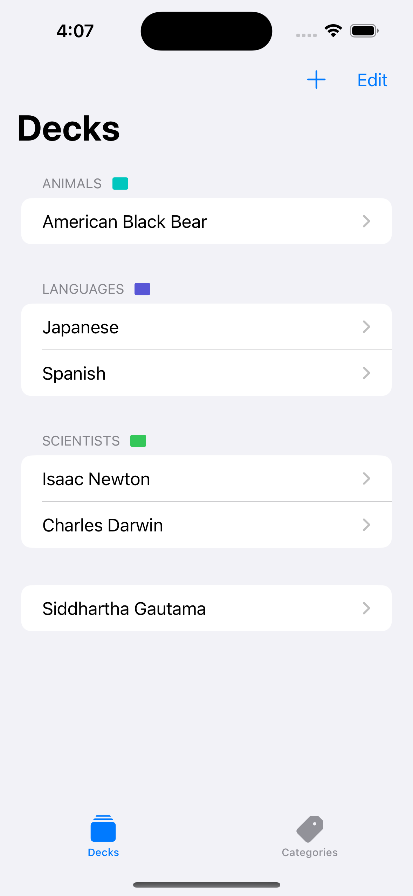
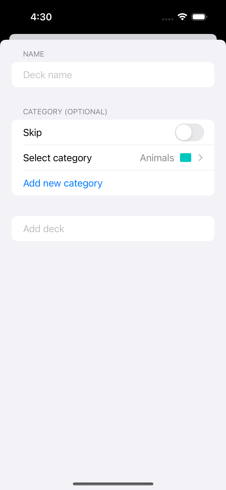
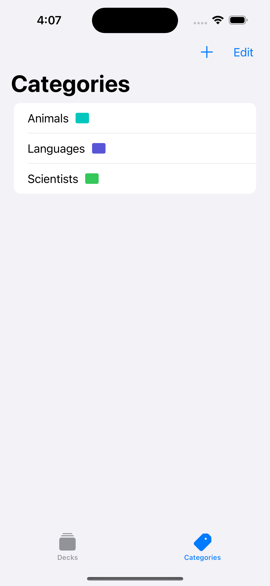
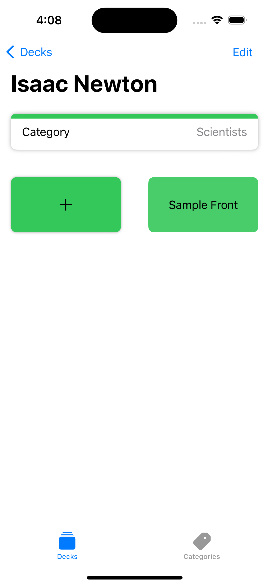
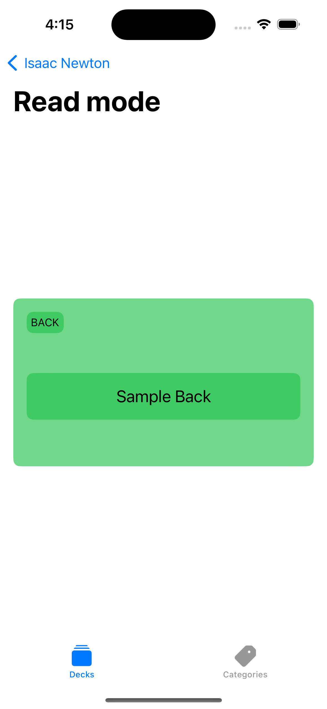

Some core screens:

 
 

## Table of contents
* [General info](#general-info)
* [Technologies](#technologies)
* [Improvements](#improvements)

## General info

This is a flashcard application, with the capabilities to:
- Create decks of flashcards
- Add a prompt and an answer to each one of those flashcards
- Add categories to each one of those decks so decks are grouped appropiately
- Review the entirety of a deck's flashcard collection through a carousel's presentation
- Display system's language appropiately (There is currently English and Spanish support)
	
## Technologies
Xcode 15 was used for development of the application and the iOS Deployment is iOS 17.0 to make the most out of Apple's newest features.

Project is created with:
* WWDC 2023 SwiftData framework
* WWDC 2023 String Catalogs
* WWDC 2023 UIContentUnavailableConfiguration

## Improvements
There is some work to improve:
* Take on deck quiz challenge's where the user could get feedback of how much they understand of the topic at hand (How many flashcards out of the total they can get right).

And there are other tech additions I would love to try:
* TipKit
* Spotlight
